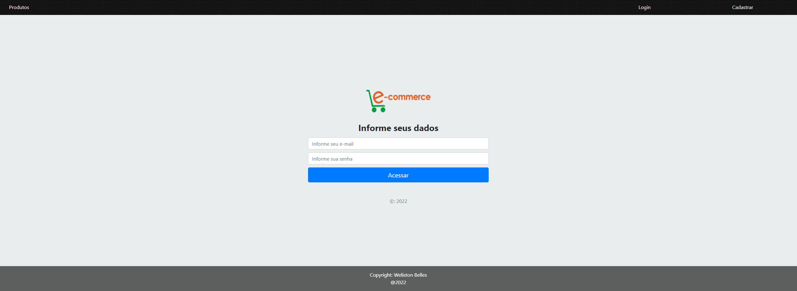
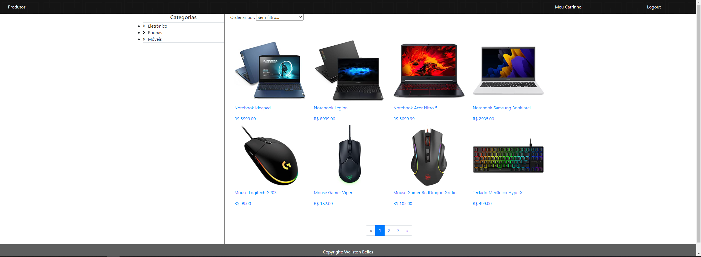
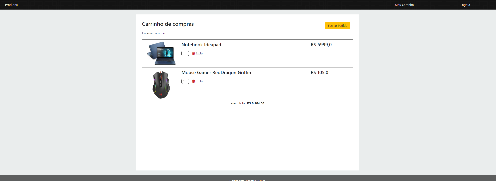

# README

<p align="center">
    <a href="#sobre">Sobre</a>
    <a href="#tecnologias">Tecnologias</a>
    <a href="#funcionalidades">Funcionalidades</a>
    <a href="#demonstracao">Demonstração</a>
    <a href="#instalacao">Instalação</a>
</p>

# Sobre
<p>Este projeto foi construído com o intuito de praticar o uso de Django e Django Rest Framework para construção de API's REST seguindo o padrão REST Full. Bem como consumi-las no Front-End.<br>
Consiste em um ecomerce onde é possível aplicar filtros por categorias, ordernar por preço em ordem Crescente/Decrescente, adicionar/remover produtos do carrinho.</p>

# Tecnologias
<div style="display: inline_block" align="center"><br>
  
  
  
  
  
  
</div>
<p>O projeto foi construído utilizando as seguintes tecnologias:</p>
<ul>
    <li>Python</li>
    <li>Django</li>
    <li>Django Rest Framework</li>
    <li>JavaScript</li>
    <li>HTML5</li>
    <li>CSS</li>
    <li>MySQL</li>
</ul>

# Funcionalidades
✔️ Criar uma conta.<br>
✔️ Realizar login.<br>
✔️ Listar os produtos.<br>
✔️ Filtrar os produtos.<br>
✔️ Adicionar um produto ao carrinho.<br>
✔️ Remover um produto do carrinho.<br>
✔️ Paginação.<br>
✔️ Responsividade.<br>

# Futuras Funcionalidades
❌ Métodos de pagamentos<br>
❌ Adicionar dashboard para os usuários adicionarem os seus produtos para venda.<br>
❌ Migrar o funcionamento do carrinho de compras para cache ao invés de session.<br>

# Demonstracao 
Link para a [aplicação](https://ecomerce-django-wb.herokuapp.com/) 🔍
<h1 align="center">
    Área de login
    
    Listagem dos produtos
    
    Carrinho de compras
    
</h1>


# Instalacao
Antes de começar, você vai precisar ter instalado em sua máquina as seguintes ferramentas:
[Git](https://gitscm.com), [Python](https://www.python.org/downloads/) e um servidor MySQL, recomendo o [MySQLWorkbench](https://dev.mysql.com/downloads/workbench/).
Além disso é bom ter um editor para trabalhar com o código como o [VSCode](https://code.visualstudio.com/download) ou o [PyCharm](https://www.jetbrains.com/pt-br/pycharm/download/) (Recomendado).

```bash
# Clone este repositório
$ git clone <https://github.com/welistonbelles/ecomerce-django>

# Acesse a pasta do projeto no terminal/cmd
$ cd ecomerce-django

# Instale as dependências
$ pip install -r requirements.txt
```
### 🔧 Configuracao
```python
# Conecte o arquivo ecomerce.sql com o seu banco de dados MySQL.

# Abra o arquivo config/settings.py e nesta parte configure de acordo com seu banco de dados
DATABASES = {
    'default': {
        'ENGINE': 'django.db.backends.mysql',
        'NAME': 'ecomerce', # noem do banco
        'USER': 'root', # usuário
        'PASSWORD': '',
        'HOST': 'localhost', # host local
        'PORT': '3306', # porta padrão
    }
}

# Após conectar com seu banco de dados, é hora de rodarmos as migrates.

# Aplique as migrations ao seu banco de dados
python manage.py migrate

# Com tudo configurado, basta rodarmos nossa aplicação:
python manage.py runserver
```